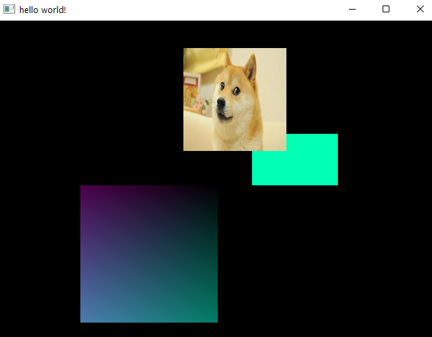

### Mini Engine (exploratory)

Mini Engine is a very tiny and lightweight OpenGL based rendering engine which can be used very flexibly and with ease.
Mini Engine can be used for quickly writing prototypes of games where you can use your own physics and entity component system etc. It can even be used for 
writing any OpenGL accelerated graphical programs like a picture drawing program or a terminal emulator.

### How do you write prototypes?

Writing prototypes is as simple as this:

```java
import engine.Init;
import engine.models.*;
import org.lwjgl.glfw.GLFW;

import java.util.ArrayList;

public class Application {

    public static void main(String[] args) {
        System.out.println("Running game");
        Init.init();
        ArrayList<IRenderData> coloredRectangles = new ArrayList<>();
        coloredRectangles.add(GradientQuad.builder().x(-400).y(-400)
                .width(400).height(400).rgb(new RGBWrapper(120, 150, 120)).build());
        coloredRectangles.add(ColoredQuad.builder().x(100).y(0)
                .width(250).height(150).rgb(new RGBWrapper(0, 255, 180)).build());
        coloredRectangles.add(TextureQuad.builder().x(-100).y(100)
                .width(300).height(300).image("doge.jpg").build());
        while (true) {
            coloredRectangles.forEach(rectangle -> {
                rectangle.getRenderType().getRenderingStrategy().execute(rectangle);
            });
            GLFW.glfwSwapBuffers(Init.window);
            GLFW.glfwPollEvents();
        }
    }
}
```

### What does the above program look like?

The above program gives the following output




### Installation and Running

- Install Maven (Maven 3 is recommended)
- Install Java JRE and JDK (At least Java 11)
- ```mvn package```
- java -jar target/<jar>